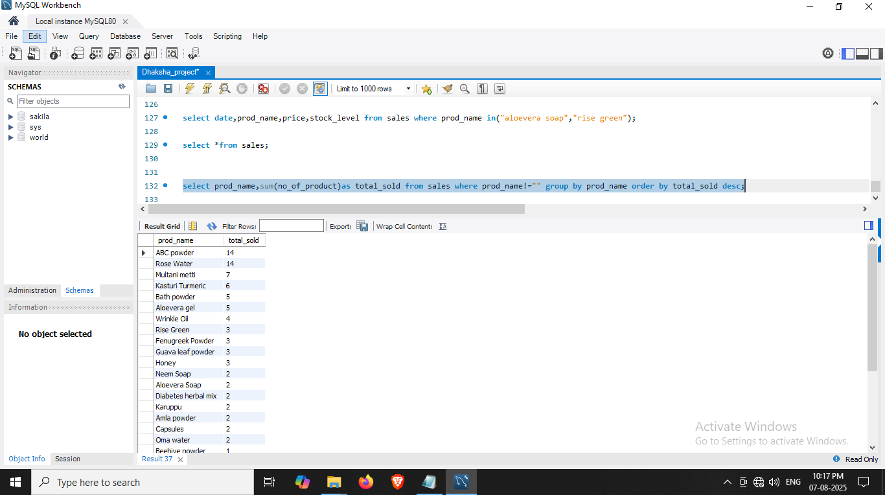

# 🛍️ Retail Shop SQL Project

This mini-project analyzes retail shop import and export data between **May 25** and **June 15** using SQL queries. It demonstrates essential SQL skills including data import, aggregation, and insights generation.

---

## 📁 Files Included

- `main_project.sql` – SQL script to create tables and import retail data.
- `insights_proj.txt` – Written summary of key insights and query results.
- `insight1_proj.PNG` to `insight6_proj.PNG` – Visual representations of insights and trends derived from SQL queries.

---

## ▶️ How to Run

1. Open your MySQL or compatible SQL client.
2. Run the `main_project.sql` file to create and load the required tables.
3. Perform your own queries or refer to `insights_proj.txt` for examples and analysis.

---

## 🔍 Sample Insight

Below is a sample visualization from the project:

*More insights available in the remaining PNG files.*

---

## 🎯 Purpose

This project aims to:
- Demonstrate SQL skills: `CREATE`, `INSERT`, `SELECT`, `GROUP BY`, `JOIN`, etc.
- Analyze retail import/export patterns.
- Derive business insights from structured data.

---

## 🛠️ Technologies Used

- **MySQL**
- **SQL Scripting**
- **GitHub** for version control
- **Manual Data Visualization** (PNG snapshots)

---

## 📌 Author

Project by [1U23CA029DHAKSHA](https://github.com/1U23CA029DHAKSHA)  
Feel free to fork ⭐, give feedback, or contribute!

---

